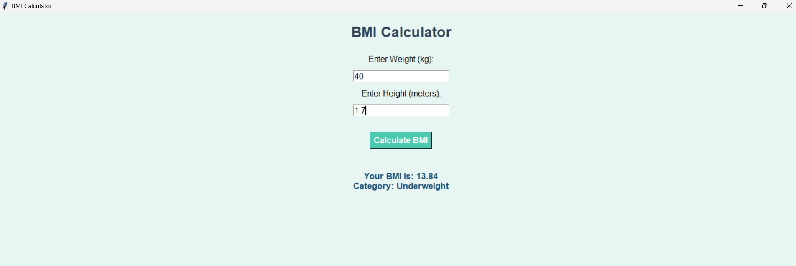
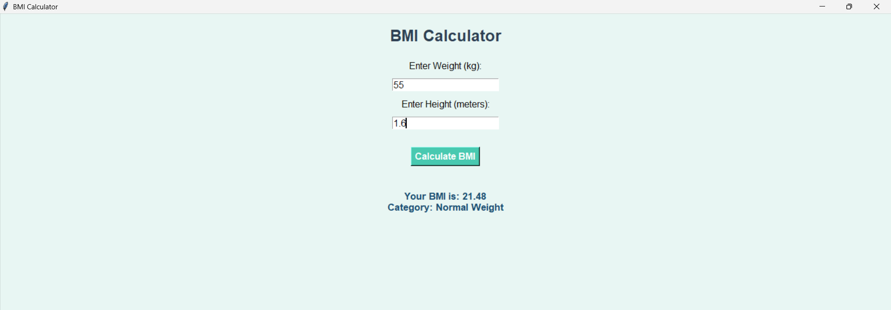
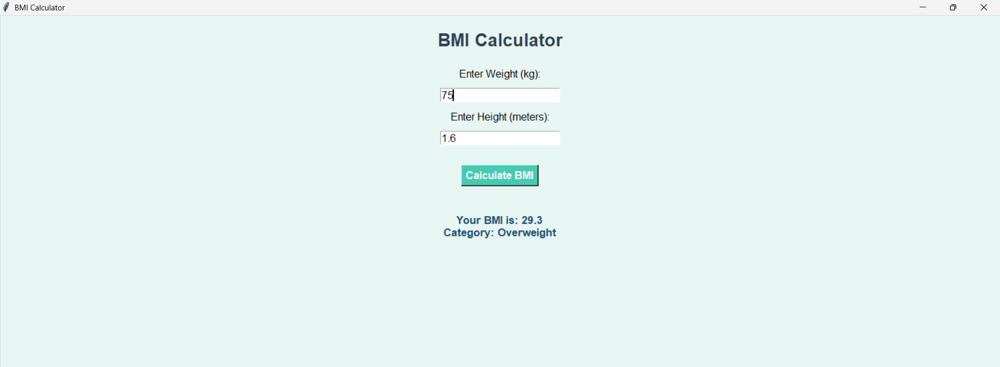
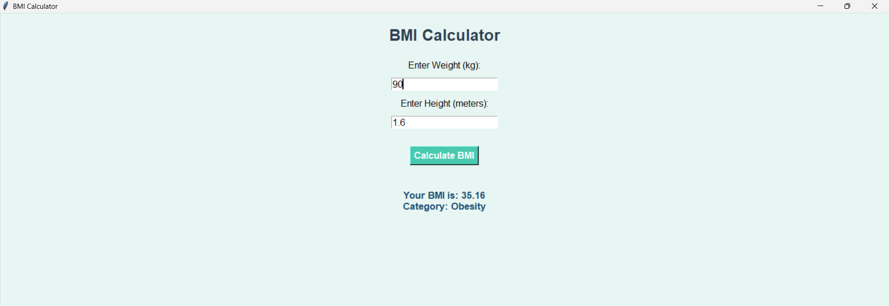

## BMI Calculator - Task 2

## Overview

This project is a simple Python BMI Calculator that helps users calculate their Body Mass Index (BMI) using their weight and height. It takes weight in kilograms and height in meters as input, calculates BMI using the standard formula, and displays the health category such as Underweight, Normal weight, Overweight, or Obesity. This project helps beginners understand basic Python concepts like input, conditions, calculations, and decision making.

---

## Features

- User-friendly GUI using Tkinter
- Weight and Height Input
- BMI Calculation
- BMI Category Detection
- Error Handling for Invalid Inputs

---

## BMI Formula

BMI = Weight (kg) / Height² (m²)

---

## BMI Categories

- Underweight → BMI less than 18.5
- Normal Weight → BMI between 18.5 and 24.9
- Overweight → BMI between 25 and 29.9
- Obesity → BMI 30 and above

---

## Technologies Used

- Python
- Tkinter
- VS Code

---

## How It Works

The program first asks the user to enter their weight in kilograms and height in meters. It then uses the BMI formula to calculate the Body Mass Index:

BMI = weight / (height × height)

After calculating the BMI value, the program checks the result using conditional statements and displays the correct health category based on the BMI range. This makes the program simple, useful, and beginner-friendly.

---

## Output

The application displays:

- BMI Value
- Health Category

---

## Output Screenshots

### UnderWeight

### NormalWeight

### OverWeight

### Obesity

---

## Future Enhancements

- BMI History Tracking
- Multiple User Records
- Graphical BMI Analysis
- Diet and Exercise Suggestions

---

## Author

Khushi Bhagat

