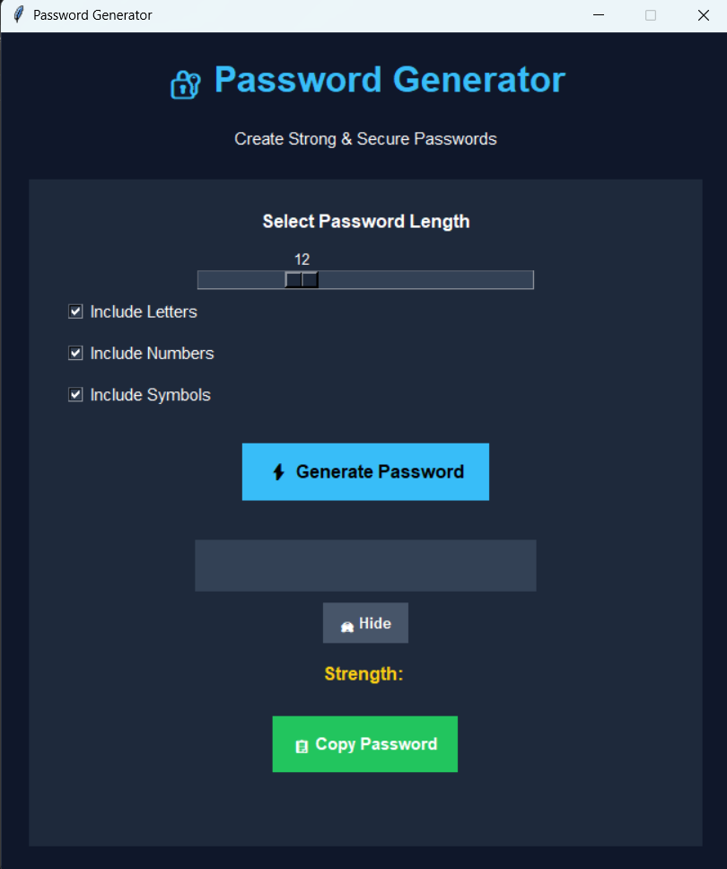
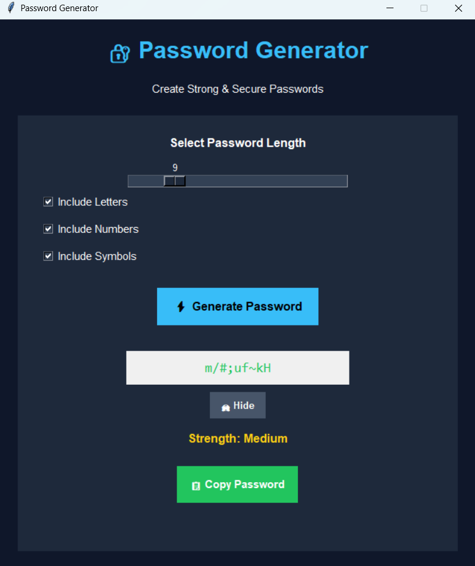

# Password Generator- Task 3

## Overview

This project is a modern Password Generator application developed using Python and Tkinter GUI.  
The application generates strong and secure random passwords based on user-selected options such as password length, letters, numbers, and symbols.  
It also includes features like password strength checking, show/hide password option, and copy to clipboard functionality.

---

## Features

- Generate secure random passwords
- User-friendly modern GUI
- Password length slider
- Include letters, numbers, and symbols
- Password strength checker
- Show/Hide password feature
- Copy password to clipboard
- Instant password generation

---

## Technologies Used

- Python
- Tkinter
- Random Module
- String Module

---

## How It Works

1. Open the application.
2. Select the password length using the slider.
3. Choose character options:
   - Letters
   - Numbers
   - Symbols
4. Click on the “Generate Password” button.
5. The application instantly creates a secure password.
6. Users can hide/show the password and copy it to the clipboard.

---

## Output

The program generates strong and random passwords according to the selected options.  
It also displays password strength such as Weak, Medium, or Strong based on password complexity.

---

## Output Screenshot

### Main Interface

### Generated Password Output

---

## Future Enhancement

- Dark/Light mode switch
- Save password feature
- Password history management
- Advanced password encryption
- Mobile-friendly version
- Custom themes and UI improvements

---

## Author
Khushi Bhagat
