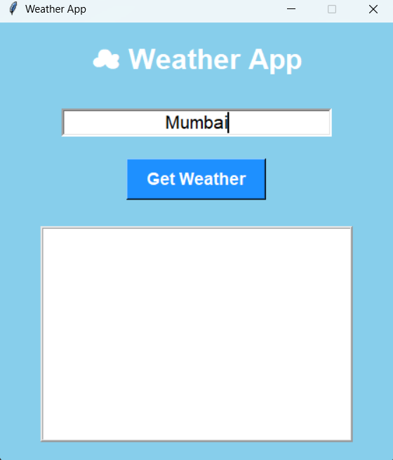
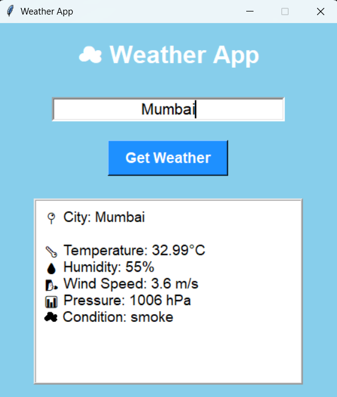

# Weather App - Task 4

## Overview
This project is a simple Weather Application developed using Python.  
The application fetches real-time weather information of any city using the OpenWeatherMap API and displays details like temperature, humidity, wind speed, pressure, and weather condition.

---

## Features
- Real-time weather updates
- User-friendly GUI using Tkinter
- Displays temperature, humidity, pressure, and wind speed
- Weather condition display
- Error handling for invalid city names
- Attractive and simple interface

---

## Technologies Used
- Python
- Tkinter
- Requests Library
- OpenWeatherMap API

---

## How It Works
1. User enters the city name.
2. Application sends request to OpenWeatherMap API.
3. API returns live weather data in JSON format.
4. Application displays weather details on the screen.

---

## Output

### Main Interface
- User can enter any city name.
- Click on “Get Weather” button.

### Weather Details Displayed
- Temperature
- Humidity
- Wind Speed
- Pressure
- Weather Condition

---

## Output Screenshots

### Main Interface

### Weather Details Displayed

---

## Future Enhancements
- Add weather icons
- Add dark mode
- Add hourly weather forecast
- Add GPS location support
- Add multiple city weather checking

---

## Author
Khushi Bhagat
